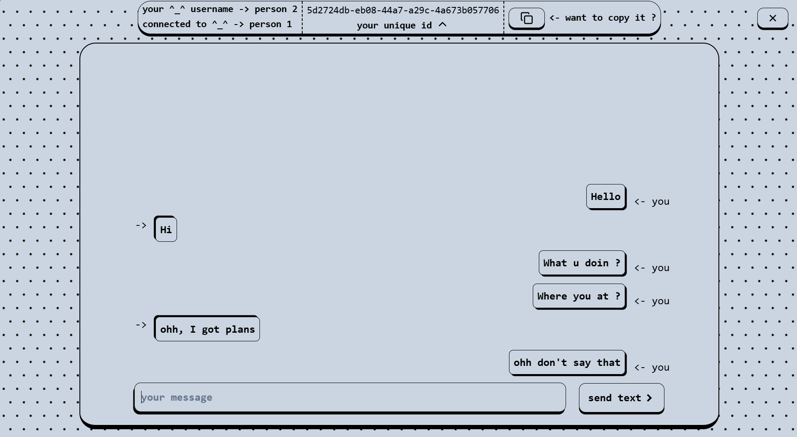

# String-Chat

String-Chat is a peer-to-peer (P2P) chat application based on Peer.js. It allows users to communicate directly without the need for a central server.

## Features

- Peer-to-peer communication
- Real-time messaging
- Easy to use interface

## Screenshots




## Installation

1. Clone the repository:
   ```bash
   git clone https://github.com/yourusername/string-chat.git
   ```
2. Navigate to the project directory:
   ```bash
   cd string-chat
   ```
3. Install the dependencies:
   ```bash
   npm install
   ```

## Usage

1. Start the application:
   ```bash
   npm run preview
   ```
2. Open your browser following the ouput in console.

## License

This project is licensed under the MIT License.
